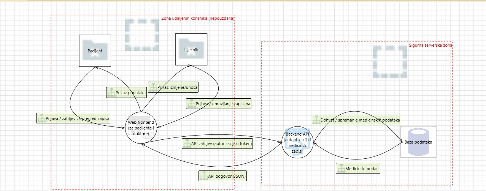
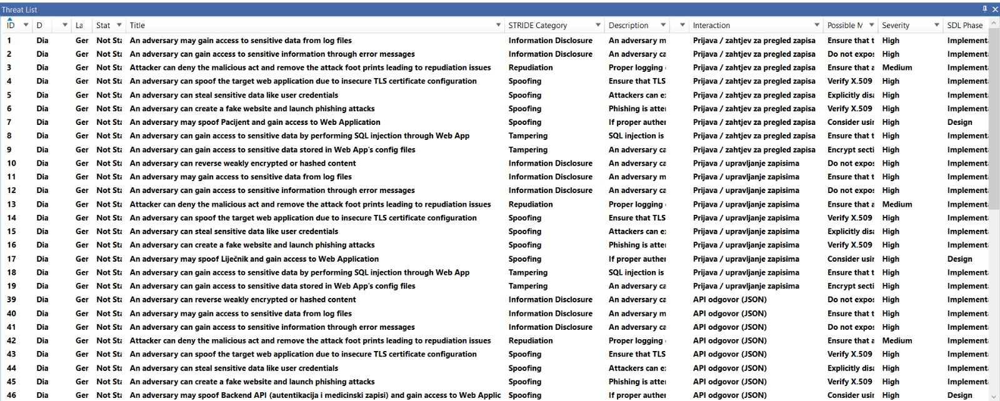
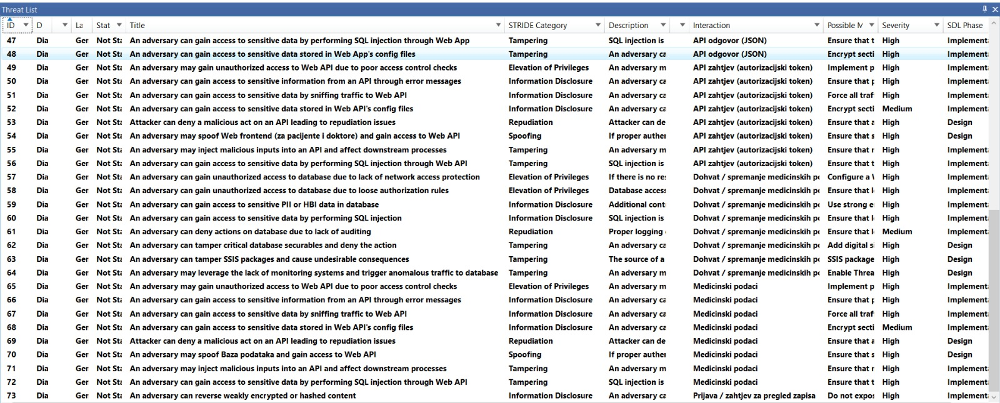

# Faza 1: Planiranje i analiza zahtjeva

## 1. Opis projekta i svrha aplikacije

Cilj projekta je integrirati sigurnosne prakse i alate u svaku fazu životnog ciklusa razvoja softvera (SDLC) kako bi se smanjile ranjivosti i povećala sigurnost cijele aplikacije. Projekt se fokusira na aplikaciju za zdravstveno područje, a ta aplikacija obrađuje osjetljive medicinske podatke kao što su dijagnoze i osobni podaci korisnika. Budući da je riječ o podacima visoke osjetljivosti, sigurnost sustava je jako bitna, a bilo koji sigurnosni propusti mogu imati ozbiljne posljedice za privatnost korisnika.

Web aplikacija omogućuje pristup zdravstvenim informacijama ovlaštenim korisnicima (pacijenti, liječnici) pri čemu su najbitniji povjerljivost, integritet i dostupnost podataka.

---

## 2. Opis aplikacije i osjetljivih podataka

Aplikacija obrađuje osobne i zdravstvene podatke korisnika koji se smatraju PHI/ePHI podacima. To uključuje:

- identifikacijske podatke (ime i prezime, OIB)
- zdravstvene podatke (dijagnoze, medicinski nalazi, povijest bolesti)
- podatke o zdravstvenom osiguranju
- zapise o pregledima i terapijama

Osim zdravstvenih zapisa, sustav može obrađivati i podatke kao što su zdravstveno osiguranje, termini pregleda i razgovori između pacijenata i liječnika. Zbog toga, aplikacija mora biti dizajnirana tako da spriječi neovlašteno otkrivanje, izmjenu ili gubitak informacija.

Zbog navedenih osjetljivih podataka, moraju se primjenjivati strogi sigurnosni zahtjevi u skladu s načelima zaštite privatnosti.

---

## 3. Microsoft Threat Modeling Tool

Na Slici 1 je prikazan model prijetnji zdravstvene web aplikacije izrađen pomoću Microsoft Threat Modeling Tool-a. Cilj je identificirati sigurnosne rizike u ranoj fazi životnog ciklusa razvoja softvera.

Sustav je podijeljen u dvije zone povjerenja:

- **Zona udaljenih korisnika (nepouzdana)**  
  Sastoji se od krajnjih korisnika aplikacije (pacijenata i liječnika) i web frontenda koji se koristi putem web preglednika. Budući da se ova zona smatra nepouzdanom, svi zahtjevi koji iz nje dolaze moraju biti strogo provjereni prije obrade.

- **Sigurna serverska zona**  
  Sadrži backend API (provodi autentikaciju i kontrolu pristupa) i bazu podataka u kojoj se pohranjuju osjetljivi zdravstveni zapisi. Backend API zadužen je za autentikaciju korisnika i kontrolu pristupa, a u bazi podataka se pohranjuju osjetljivi zdravstveni zapisi. Ova zona predstavlja pouzdano okruženje u kojem se provode ključne sigurnosne kontrole.

Komunikacija između elemenata napravljena je pomoću tokova zahtjeva i odgovora. Pacijent i liječnik komuniciraju isključivo s web frontendom (preko njega šalju zahtjeve za prijavu, pregledavanje, upisivanje ili brisanje podataka te primaju kao odgovor prikaz podataka). Web frontend zatim prosljeđuje zahtjeve backend API-ju u obliku API poziva koji sadrže autorizacijski token. Backend API obrađuje zahtjeve, provodi provjere identiteta i ovlasti te po potrebi dohvaća ili sprema podatke u bazu podataka. Odgovori se istim putem vraćaju prema web frontendu, koji ih prikazuje korisnicima.

Model jasno prikazuje da ne postoji izravna komunikacija između korisnika ili web frontenda s bazom podataka, čime se smanjuje rizik neovlaštenog pristupa osjetljivim podacima.

---

**Slika 1.** Microsoft Threat Modeling Tool  

**Slika 2.** Rezultati analize u Microsoft Threat Modeling Tool-u 

**Slika 3.** Rezultati analize u Microsoft Threat Modeling Tool-u (2)

Alat Microsoft Threat Modeling Tool izradio je listu sigurnosnih prijetnji primjenom STRIDE metodologije. Identificirane prijetnje su vidljive na Slici 2 i Slici 3, a odnose se na kategorije:

- Information Disclosure  
- Spoofing  
- Tampering  
- Elevation of Privileges  
- Repudiation  

Najveći broj prijetnji pripada kategoriji Information Disclosure, a ona predstavlja rizik neovlaštenog otkrivanja elektroničkih zdravstvenih podataka (ePHI), npr. kroz poruke o pogreškama, zapise sustava ili API odgovore. Ove prijetnje u kontekstu zdravstvenog sustava imaju visoku razinu rizika (High) zbog osjetljivosti medicinskih zapisa.

Prijetnje iz kategorija Spoofing i Elevation of Privileges odnose se na mogućnost lažnog predstavljanja korisnika ili neovlaštenog stjecanja ovlasti koje su veće od njegovih trenutnih, npr.  kada bi pacijent pristupio podacima sa ovlastima namijenjenima liječniku. Takvi scenariji predstavljaju ozbiljan sigurnosni rizik te su većinom označeni razinom High.

Kategorija Tampering sadrži prijetnje vezane uz neovlaštenu izmjenu medicinskih podataka ili logike aplikacije, a to može ugroziti integritet zdravstvenih zapisa. Prijetnje iz ove kategorije također su označene kao High. 

Manji broj prijetnji iz kategorije Repudiation označen je razinom rizika Medium jer se odnosi na mogućnost poricanja radnji ako se nije dovoljno zapisivao pristup.

---

## 4. Sigurnosni zahtjevi sustava

S obzirom na to da sustav obrađuje elektroničke zdravstvene podatke (ePHI), definirani su sljedeći sigurnosni zahtjevi:

### 4.1. Autentikacija korisnika

Sustav mora osigurati pouzdanu provjeru identiteta korisnika prije pristupa podacima. Pristup sustavu omogućen je isključivo prijavljenim korisnicima, a autentikacija se provodi putem korisničkog imena i lozinke.

### 4.2. Autorizacija i kontrola pristupa

Sustav mora provoditi kontrolu pristupa temeljenu na ulogama (RBAC) kako bi se osiguralo da korisnici mogu pristupati samo onim podacima i funkcionalnostima za koje imaju odgovarajuće ovlasti. Pacijenti smiju pristupati isključivo vlastitim medicinskim zapisima, a liječnici imaju ovlasti za pregled i upravljanje medicinskim zapisima pacijenata. Neovlašteni pristup funkcionalnostima i podacima mora biti onemogućen.

### 4.3. Enkripcija podataka

Osjetljivi zdravstveni podaci moraju biti zaštićeni enkripcijom tijekom prijenosa i pohrane. Komunikacija između klijenta i serverskih komponenti mora biti osigurana korištenjem HTTPS-a, a  podaci se u bazu trebaju pohranjivati u šifriranom obliku ili uz odgovarajuće zaštitne mehanizme.

### 4.4. Zapisivanje i revizija (logging i auditing)

Sustav mora bilježiti sve sigurnosno relevantne događaje, npr. prijave korisnika, pristup medicinskim zapisima te izmjene podataka. Audit zapisi moraju sadržavati identitet korisnika, vrijeme događaja i vrstu izvršene radnje. Kasnije je onda moguća revizija radnji i tako se spriječava poricanje radnji.

### 4.5. Zaštita od zloupotrebe i napada

Sustav mora imati osnovne mehanizme zaštite od napada poput brute-force pokušaja prijave, SQL injection napada i neovlaštenog pristupa API-ju. Tako se osigurava povjerljivost i integritet medicinskih podataka.

---

## 5. Zaključak

Rezultati ove faze predstavljaju temelj za daljnje faze SDLC procesa u kojima će sigurnosni zahtjevi biti implementirani i testirani. Identifikacijom sigurnosnih prijetnji i definiranjem sigurnosnih zahtjeva osigurava se jasna smjernica za dizajn, implementaciju i testiranje sigurnosnih mehanizama u sljedećim fazama projekta. Cilj je izgraditi siguran i pouzdan zdravstveni informacijski sustav u skladu s načelima zaštite privatnosti i regulatornim zahtjevima. 
