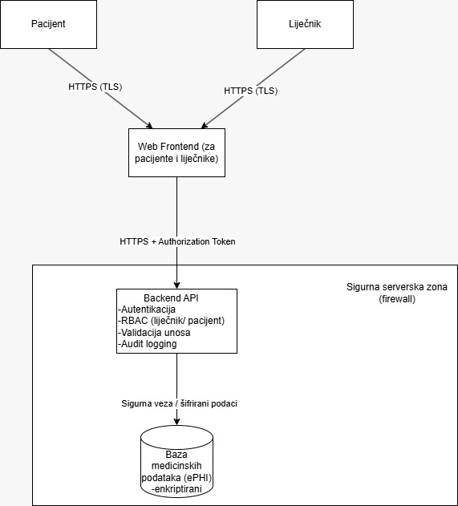

# Faza 2: Dizajn

## 1. Sigurnosna arhitektura sustava

Arhitektura sustava temelji se na razdvajanju odgovornosti i jasno definiranim sigurnosnim granicama između pojedinih komponenti. Sustav se sastoji od sljedećih glavnih komponenti:

- web frontend (portal za pacijente i liječnike)
- backend API
- baza medicinskih podataka

Komunikacija između web frontenda i backend API-ja odvija se isključivo putem sigurnog protokola HTTPS, a time se osigurava enkripcija podataka u prijenosu. Backend API predstavlja centralnu točku sigurnosti, a tu se provode autentikacija korisnika, kontrola pristupa i validacija svih dolaznih zahtjeva.

Baza medicinskih podataka smještena je u sigurnoj serverskoj zoni i nije izravno dostupna korisnicima ni web frontendu. Pristup bazi omogućen je isključivo putem backend API-ja, čime se dodatno smanjuje rizik neovlaštenog pristupa osjetljivim zdravstvenim podacima.

### 2. Sigurnosni mehanizmi u arhitekturi

U arhitekturi sustava primijenjeni su sljedeći sigurnosni mehanizmi:

- korištenje HTTPS protokola za svu komunikaciju
- razdvajanje nepouzdanog korisničkog okruženja od serverskog dijela sustava
- centralizirana autentikacija i autorizacija u backend API-ju
- ograničavanje pristupa bazi podataka samo backend komponenti

Ovakav arhitekturni pristup omogućuje jasnu kontrolu sigurnosnih tokova i smanjuje površinu napada sustava.

*Slika 1. Dijagram arhitekture*

---

## 3. Obrasci sigurnosnog dizajna

U dizajnu zdravstvene web aplikacije predviđena je primjena standardnih obrazaca sigurnosnog dizajna kako bi se ublažile prijetnje identificirane u fazi modeliranja prijetnji. Poseban naglasak stavljen je na sigurno upravljanje sesijama, provjeru valjanosti korisničkog unosa i sigurno rukovanje pogreškama, budući da ovi obrasci adresiraju najčešće sigurnosne rizike u web aplikacijama.

### 3.1. Sigurno upravljanje sesijama

Sigurno upravljanje sesijama planirano je korištenjem token-based autentikacije. Svaki zahtjev prema backend API-ju mora sadržavati važeći autorizacijski token, čime se osigurava pouzdana identifikacija korisnika. Ovakav pristup smanjuje rizik od krađe sesije, ponovne upotrebe tokena i lažnog predstavljanja korisnika.

### 3.2. Provjera valjanosti unosa

Provjera valjanosti korisničkog unosa provodi se na serverskoj strani, budući da svi podaci dolaze iz nepouzdanog korisničkog okruženja. Ovim pristupom sprječavaju se napadi poput SQL injectiona i neovlaštene manipulacije podacima te se osigurava integritet medicinskih zapisa.

### 3.3. Sigurno rukovanje pogreškama

Sigurno rukovanje pogreškama planirano je na način da se korisnicima prikazuju generičke poruke o pogreškama, bez otkrivanja tehničkih detalja sustava. Detaljne informacije o pogreškama bilježe se u zapisnicima sustava i dostupne su isključivo administratorima. Ovakav pristup smanjuje rizik od neovlaštenog otkrivanja osjetljivih informacija.
